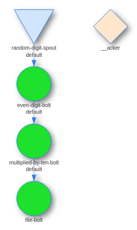

# Simple Storm App

## Source
- https://dev.to/usamaashraf/playing-with-apache-storm-on-docker---like-a-boss-4bgb
- https://github.com/apache/storm
- https://www.baeldung.com/apache-storm

## Directory Structure
Module A
- main methods
- Spouts, Bolts and Topologies
Module B
- dummy module for other java files

## Logging
Modify the logpath in :
- ModuleA/src/main/resources/log4j2.xml
- ModuleB/src/main/resources/log4j2.xml
Logs are also available in *supervisor-container:/data/workers/<id>/artifacts/worker.log*

## Building and running
- Modify the docker shared volume in *docker/stack.yaml* to the directory where the build files are
- ./buildAll.sh
- *docker-compose -f docker/stack.yml up* or *docker-compose -f docker/stack.yml up --detach*
- login into the nimbus container (*docker exec -ti <container_id> bash*)
- *storm jar ModuleA/target/ModuleA-1.0.0-SNAPSHOT.jar com.example.OurSimpleTopology*
- after killing the topology, the dump file can be found in supervisor-container:/data/ModuleA.dump

